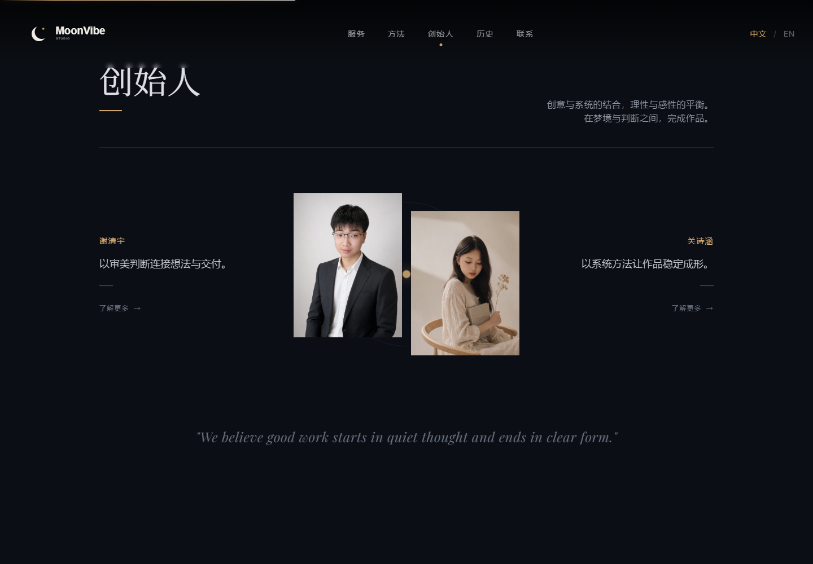
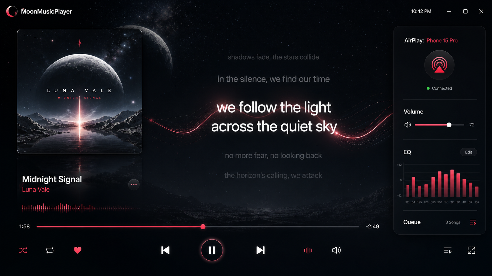

  <picture>
    <source media="(prefers-color-scheme: dark)" srcset="./logo/png/favicon-512.png">
    <source media="(prefers-color-scheme: light)" srcset="./logo/png/moonvibe-mark-black-transparent.png">
    
  </picture>

  <h1>MoonVibe Studio</h1>
  <h3>让未成形的灵感，拥有清醒的形状。</h3>
  
<em>Dream with awareness. Quiet ideas, visible form.</em>

---

## 关于 MoonVibe

MoonVibe Studio 是一间连接创意表达与技术实现的独立工作室。我们在梦境与判断之间工作：保留想象，厘清问题，再通过设计、影像、软件与 AI，让想法成为真实可用的作品。

| 梦境 Dream | 觉察 Awareness | 潜能 Potential |
| --- | --- | --- |
| 保留尚未完成的想象 | 在信息与直觉之间保持判断 | 用创意与系统让作品成形 |

## 我们在做什么

| 创作表达 | 技术实现 |
| --- | --- |
| 视觉设计与品牌叙事 影片与数字内容 AI 辅助创作 | Web 与跨平台桌面应用 Electron、Tauri、TUI / CLI AI 工作流与行业软件 |

我们不为技术而技术，也不让创意停留在概念。每个项目都从真实问题出发，在审美判断、系统设计与可靠交付之间寻找平衡。

## 代表作品

### MoonVibe Studio Website

MoonVibe Studio 的双语品牌网站，以安静的夜色、克制的动效和清晰的叙事呈现工作室的服务、方法、创始人与发展历程。

`HTML` · `Tailwind CSS` · `GSAP` · `Responsive Design`

### MoonMusicPlayer

面向 Windows 大屏场景的沉浸式音乐播放器实验项目，探索 AirPlay 接收、动态歌词、音频可视化与桌面端交互体验。

`Electron` · `React` · `TypeScript` · `Vite` · `AirPlay`

### 砂轮配方智能管理系统

面向工业现场的数据治理与配方管理原型，围绕 Excel 导入、AI 结构化识别、版本追踪、审核留痕与本地数据安全展开。

`Electron` · `React` · `TypeScript` · `SQLite` · `AI Workflow`

## 我们的方法

  <strong>观察 Observe</strong> → <strong>定义 Define</strong> → <strong>生成 Generate</strong> → <strong>修正 Refine</strong> → <strong>交付 Deliver</strong>

<em>好的作品始于安静的思考，终于清晰的形态。</em>

## 与我们联系

如果你正在寻找创意与技术之间更清醒的连接，欢迎浏览我们的项目，或通过邮件与我们交流。

[联系 MoonVibe Studio](mailto:support@mail.moonvibe.click) · `support@mail.moonvibe.click`

---

  © 2026 MoonVibe Studio · Dream · Awareness · Potential

